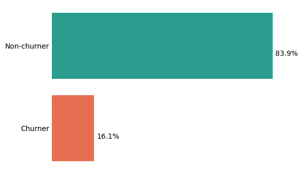
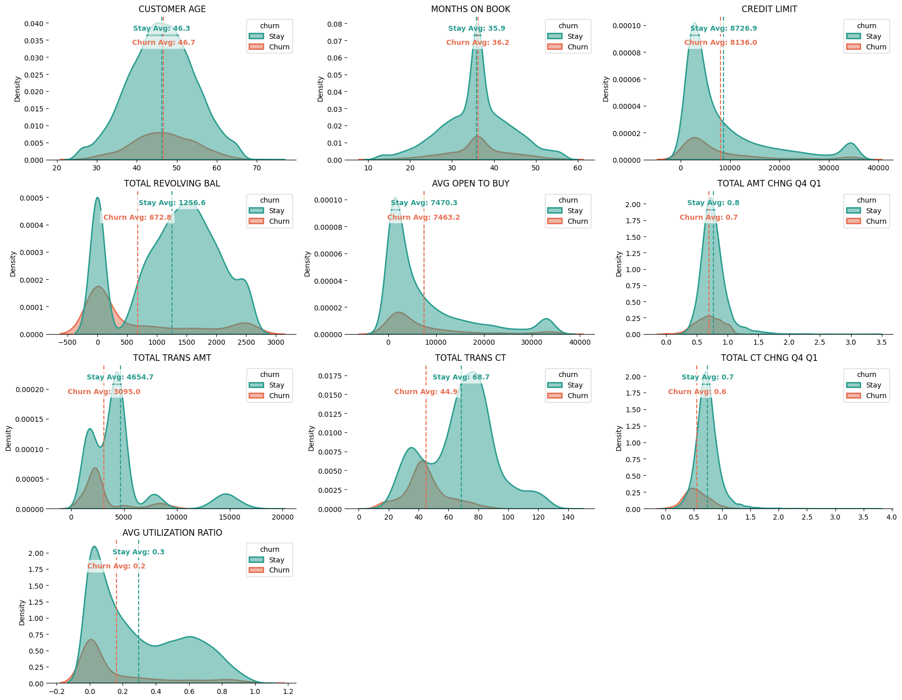
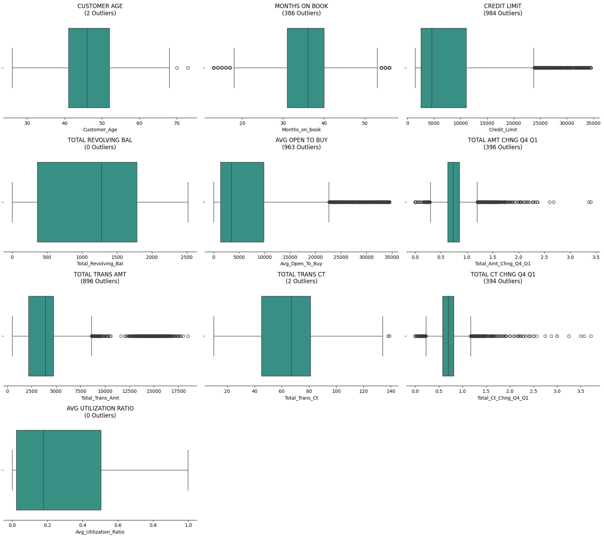
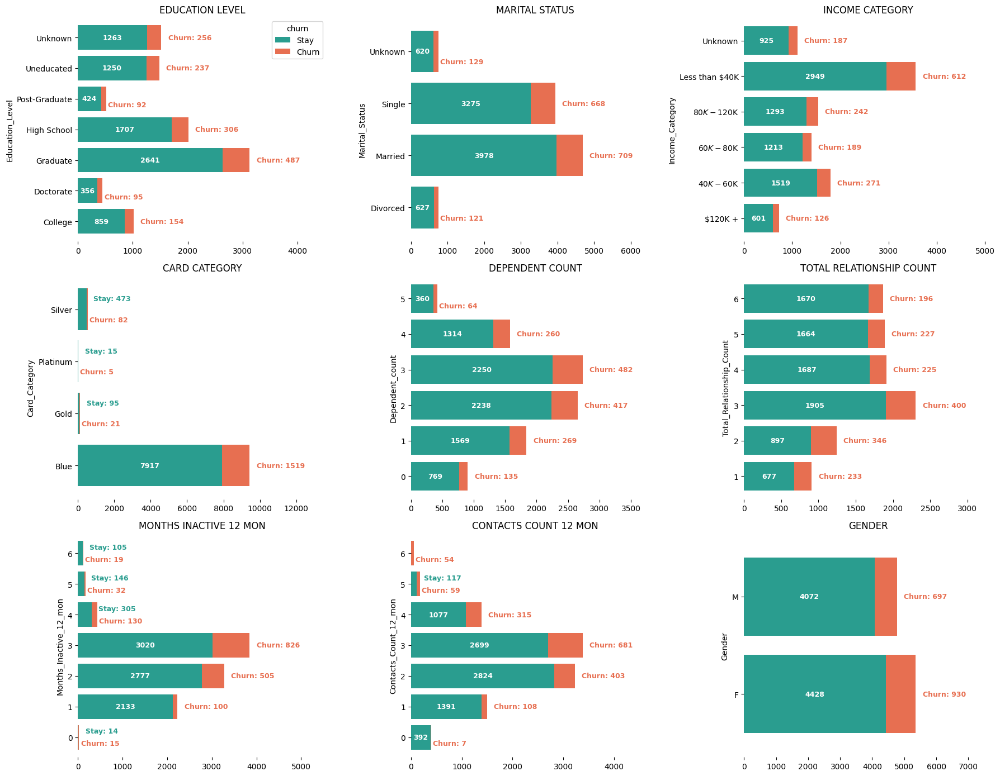
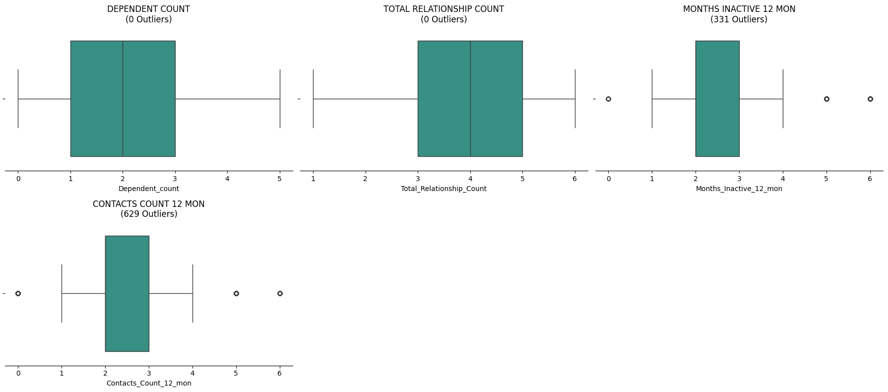
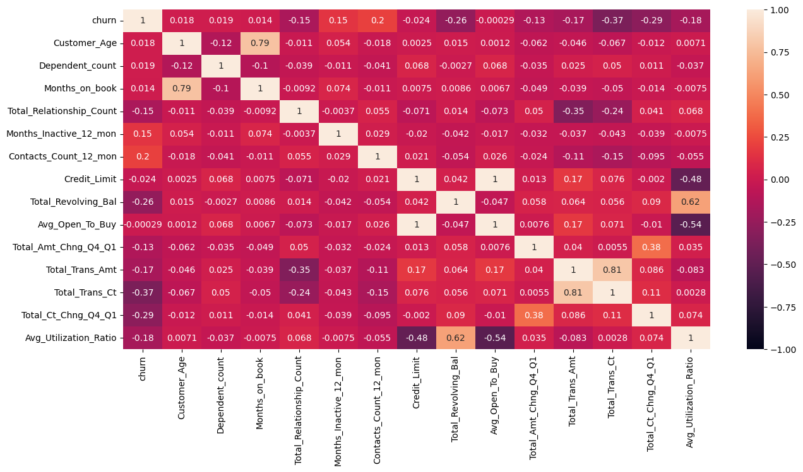
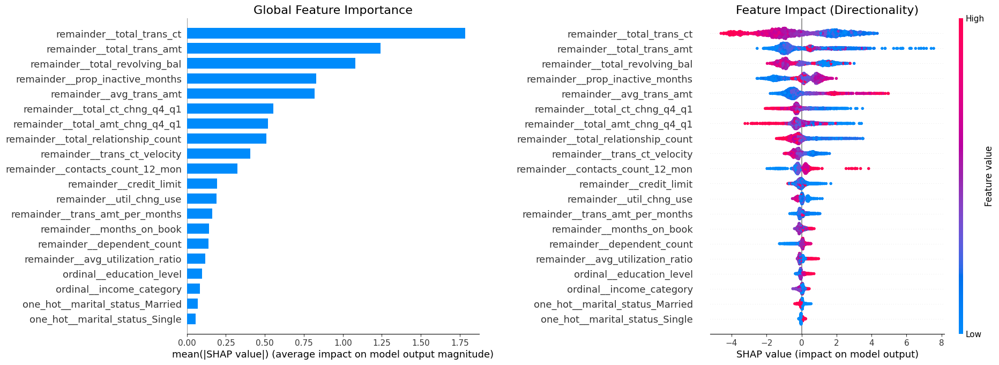
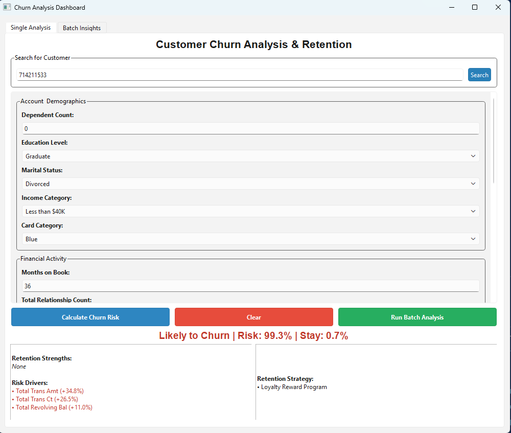
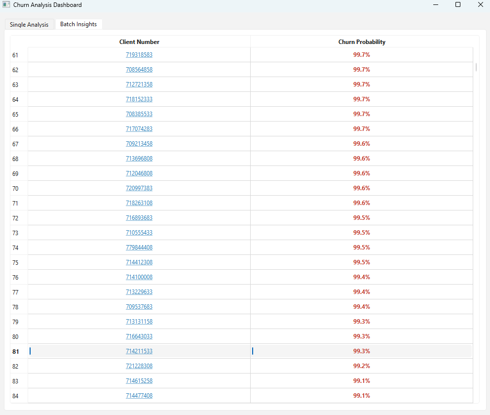

# Churn Rate of Credit Card Customers Analysis

## Table of Contents

- [1. Description](#1-description)
- [App Quick Start](#app-quick-start)
- [2. Features](#2-features)
- [3. Technology, Tools, and Developers](#3-technology-tools-and-developers)
- [4. Business Problem and Objectives](#4-business-problem-and-objectives)
- [5. Solution Pipeline](#5-solution-pipeline)
- [6. Exploratory Data Analysis](#6-exploratory-data-analysis)
- [7. Modeling](#7-modeling)
- [8. Application & User Interface](#8-application--user-interface)
- [9. Project Structure](#9-project-structure)
- [10. Setup and Run Commands](#10-setup-and-run-commands)

## 1. Description:
  * This project's goal was to create a full-stack app that predicts the likelihood a credit card customer will leave the company's services using a trained machine learning model. The app provides a real-time prediction interface and supports batch analysis.
### Process
  * For this project, I followed the CRISP-DM framework throughout and used modular coding to easily identify errors and clearly define the pipeline stages. The first thing I did was to try to clearly understand the dataset chosen and obtained for this project. The analysis and modeling of the dataset were performed in the Jupyter notebook named “EDA_Modeling.ipynb.” After completing the steps in the notebook, I separated it into Python scripts within clearly defined pipeline stages, such as “Data Ingestion,” “Data Transformation,” “Model Training,” and “Model Evaluation.” Each section in the pipeline had its own purpose. “Data Ingestion” involved loading the data, dropping unnecessary columns, and setting the client number as the index for later use. “Data Transformation” involved splitting the dataframe into three sets: the training set, the testing set, and the validation set. It also includes the preprocessor, which is created and will be utilized in the next stage to transform the training set. In the “Model Training” stage, the model is trained using the preprocessor created in the “Data Transformation” stage. In the last stage, “Model Evaluation,” the test set is used to see how well the trained model performed. The entire pipeline is implemented using MLflow to track datasets, model evaluations, and the model itself for traceability. An information logger is also used to track all of the stages of the pipeline and evaluations. After the entire pipeline was completed, I created the app using FastAPI for the background and PySide6 for the graphical user interface. The project also supports several ways to run this app, including conda with an environment.yml file, a .venv folder for all dependencies, and the regular requirements.txt for running just the pre-made model and app, or the requirements-dev.txt for all dependencies to run all the notebooks and the pipeline.

## App Quick Start

```powershell
.\.venv\Scripts\Activate.ps1
pip install -r requirements.txt
python run_app.py
```

See Section 10 for full setup options (Conda, training pipeline, and API tests).

## 2. Features
  * Real-Time Prediction: Input data to estimate churn risk percentage.

  * Explainable AI (SHAP XAI): Displays the top 3 features responsible for "Risk Drivers" and "Retention Strengths" using SHAP values.

  * Batch Analysis: Process the validation dataset as a new batch of accounts,  to simulate the app running live. 

  * Customer Search: Enter the customer's client number from the validation set to retrieve the client's information for calculating the customer's churn percentage.

## 3. Technology, Tools, and Developers
  * The tools and developers I used in the project included Python libraries such as Pandas, Numpy, Matplotlib, Seaborn, Scikit-Learn, Optuna, LightGBM, XGBoost, SHAP, FastAPI, and PySide6. Jupyter Notebooks were used for the beginning analysis and modeling, GitHub for version control, and Kaggle for obtaining the dataset. Windows Subsystem for Linux for Conda was used in the terminal, and all code was developed in Visual Studio Code. For technology, I use my laptop to run and develop the code for this project. 

## 4. Business Problem and Objectives:

### A. Business Problem:
  * A Company that issues credit cards has recently noticed an uptick in customers leaving its service and has only been able to retain them when they call to cancel their credit card accounts. The company wants to switch to a proactive approach to retaining high-risk customers, rather than the reactive approach that has not been working well for them. To make that switch, they would like an app the company can use to identify customers early by showing which transactional or behavioral features are causing them to leave. After identifying those features, can they be used to reliably predict which customers are likely to leave? 

### B. Business Objectives:
1. Identify factors associated with customer churn. 
  * Use SHAP and a correlation graph to highlight features with high churn rates and assess their correlations. 
2. Shift from Reactive to Proactive 
  * Train a machine learning model to predict whether a customer will leave, achieving a recall and precision above 80% and an AUC-ROC above 98%. 
3. Implement targeted retention strategies based on features associated with high churn to reduce customer attrition. 
  * If the machine learning model predicts that the customer has a high likelihood of leaving the company, use SHAP values to identify which incentives to offer based on the top features present.

### C. Data and Metrics Needed for Project to be Considered a Success:
1. For this situation, a dataset with a decent churn rate is needed to deliver a solution for this business problem.
  * The dataset was obtained from Kaggle and includes __[Credit Card Customers](https://www.kaggle.com/datasets/sakshigoyal7/credit-card-customers?sort=votes)__, with a 16.1% churn rate, which can be used to develop a solution to this business problem.
2. Measures of success
  * For this problem to be considered solved, the model must have recall and precision scores over 80% and an AUC & ROC score over 0.90, to be considered a functional model for this project.
  * It must also maintain data integrity at over 99% to ensure accurate predictions and prevent data drift, which may make the model unreliable. 

### D. Project Benefits:
1. Business & Financial Benefits:
  * Reduced Customer Churn: 
    - By identifying churn patterns early in the project's app, the company can intervene to retain customers while protecting its revenue stream.
  * Lower Retention Cost: 
    - It is much cheaper to retain a customer than to acquire a new one. This project's app will help ensure the retention effort is directed to the right customers.
  * Strategic Resource Allocation: 
    - Rather than offering deals to all customers, this app enables the company to focus only on those most likely to leave.

2. Operational & Staff Benefits:
  * Actionable Intelligence:
    - Rather than just giving a yes-or-no answer on whether the customer is leaving, the app shows the top reasons the customer is leaving, allowing staff to send targeted offers to retain them.
  * Workflow Efficiency:
    - The added Batch Prediction feature allows users to process thousands of records in seconds, rather than having staff spend a day manually reviewing data to identify which customers may churn.

3. Technical & Analytical Benefits:
  * Explainable AI (SHAP XAI):
    - With SHAP Explainable AI, the project demonstrates the transparency required in the highly regulated financial industry. SHAP values highlight the top factors contributing to churn.
  * Data-Driven Feedback Loop:
    - The logging system, using a custom info logger and MLflow, tracks every prediction and supports continuous model improvement.

### E. Proposed Value for the Staff
  * For the Manager: "Who should I call today?" --> Batch Prediction Table
  * For the Analyst: "Why is this customer leaving?" --> Top Risk Drivers
  * For the Developers: "Is the System Healthy?" --> Automated Logs & Test Scripts

## 5. Solution Pipeline
1. Collect Data
2. Conduct Exploratory Data Analysis (EDA) to identify key patterns, trends, and variable relationships using statistical summaries and visualizations.
3. Split the dataset into training and testing sets.
4. Data preprocessing and transformation pipeline
5. Model benchmarking
6. Select the model with the highest performance.
7. Tune hyperparameters using Optuna, running 30 trials to determine the best hyperparameters.
8. Evaluate the model using the test dataset.
9. Use Shapley values, a method from cooperative game theory, to identify which input features have the greatest impact on the model’s predictions.
10. Show final deliverables to potential customers, including cost savings achieved with the solution.
11. Refactor code for production using modularization
12. Implement robust logging and exception handling to facilitate system maintenance and debugging.
13. Develop an app with a backend and a frontend.
14. Simulate for latency, thresholds, and drift checks.

## 6. Exploratory Data Analysis

* __Class Imbalance__: The churn rate in the dataset was 16.1%, while the non-churn rate was 83.9%, resulting in a significant imbalance. This will make it harder to find a machine learning model that would be able to handle the imbalance, since unoptimized models tend to skew more to the majority class, which is the customer who did not churn. 

### Retention vs. Churn Rate


  * __Feature Variations__: This dataset contains three types of features: continuous numerical, ordered categorical-numerical, and categorical. Plotting these types of data revealed variations in the proportions of those who stayed and churned. It becomes more noticeable when analyzing the outlier distributions. 

### Numerical Feature Analysis (KDE Distributions)

  * Insights derived from Kernel Density Estimate (KDE) plots of Demographic and Behavioral Numerical Features:

  > 1. __Transactional Velocity (total_trans_ct & total_trans_amt)__: A gap exists between retained and churned customers. On average, retained customers make __70 transactions__ per year and spend around __$4,654__. Churned customers make __45 transactions__ and spend about __$3,095__ per year. This may suggest customers slow down their card usage before they churn. 

  > 2. __Zero-Balance Signal (total_revolving_bal)__: There is a clear jump in the revolving balance graph over $0. This could indicate greater financial responsibility, but in credit portfolios, it may suggest that the customer has switched to another company's products.

  > 3. __Quarterly Momentum (total_ct_chng_q4_q1 & total_amt_chng_q4_q1)__: Churners show a compression in spending amount and count from quarter 1 to quarter 4. This shows a gradual decrease in card usage, not a sudden stop.

  > 4. __High-Value Exposure (credit_limit)__: There is a prominent peak over __$34,000+ in credit limit__ with customers who have churned. The company is losing its highest-cap accounts, which magnifies potential revenue loss. 

  > 5. __Demographic vs Behavioral (customer_age & months_on_book)__: Curves of retention and churn are nearly identical for customer age and months on book. The issue is more about __behavior__ (card usage) than __demographics__ (who the customers are). 

### Outliers in the Numerical Features


  > * Looking at the data extremes, there are a few fascinating patterns that point directly to bank policy and sudden shifts in customer behavior:

  > * __The Secret Ceiling (credit_limit & avg_open_to_buy)__: These features show a massive cluster of outliers (984 and 963, respectively) that abruptly flatten out right around $34,500. This isn't random; it strongly implies a hard institutional cap set by the bank's internal credit policy.

  > * __The High-Roller Gap (total_trans_amt)__: Out of the 896 outliers, the majority of the baseline customers spend under $5,000 annually. However, a distinct, high-value group stretches all the way up to $17,500. Losing individuals in this outlier bracket represents an outsized revenue hit.

  > * __Sudden Whiplash (total_amt_chng_q4_q1 & total_ct_chng_q4_q1)__: With roughly 395 outliers on both ends of these distributions, we see two extremes. On the right, you have customers who suddenly doubled their card usage heading into the final quarter. On the left, you see people whose activity completely fell off a cliff. In a churn model, the left tail is our problem area.

### Categorical & Profile Analysis

  * Analyzing how customer profile categories overlap with churn reveals some intense behavioral thresholds:
  > 1. __The "Single-Product" Trap (total_relationship_count)__: Most bank users hold several products, but a small group with only 1 or 2 products has a massive churn rate—showing that low product stickiness makes it easy for customers to walk away.

  > 2. __The 5-Contact Breaking Point (contacts_count_12_mon)__: This is a red flag area in the features. Once a customer calls support 5 times in a year, their probability of leaving spikes to nearly 50%. By contact 6, it approaches 100%. This isn't just an outlier statistic; it’s an active distress signal showing imminent churn.

  > 3. __The 3-Month Silent Window (months_inactive_12_mon)__: Over 950 departed users sit cleanly within the 3-to-4-month inactivity bracket. In terms of absolute volume, this is the main danger zone where a customer transitions from "just not using the card" to completely checking out.

  > 4. __The Blue Card Exposure (card_category)__: While premium tiers exist, the entry level Blue Card tier accounts for over 93% of the customer base and has the highest baseline churn. Due to its size, even a slight rise in Blue Card departures triggers a major financial ripple across the portfolio.

### Outliers in Numerical-Categorical & Categorical Features


  * While these specific categories don't have many statistical anomalies, the ones that do appear are incredibly vital. For instance, hitting 5+ customer support contacts or crossing into 5–6 months of complete dormancy are technically outliers on a boxplot, but they aren't noise. They represent "ghost accounts" or highly frustrated users on the verge of abandoning the bank entirely. Treating these specific extremes as critical early-warning tripwires is exactly how the bank can intercept churn before it happens.


### Correlation Graph with Churn

* Using a correlation heatmap to map our numerical features against churn shows us exactly where the problems lie. The data tells a very clear story: a customer's risk profile isn't defined by who they are, but by how their habits change.

  > * __The Top Churn Accelerators: * Frustration & Outreach (contacts_count_12_mon):__ As customer service interactions climb, churn risk follows lockstep. It is the strongest positive linear indicator of a customer on the way out.

    > * __The Activity Fade (total_trans_ct & total_ct_chng_q4_q1)__: A dropping transaction count and a collapsing quarterly momentum score share a strong inverse relationship with churn. When card swipes slow down, the countdown to departure has officially started.

      > * __The Ghost Balance (total_revolving_bal)__: Portfolios hitting a $0 balance carry a heavily elevated risk of churning, marking them as completely idle accounts.

* __Spotting Redundancies (Pipeline Cleanup)__: The heatmap also did us a massive favor by exposing features that are essentially saying the exact same thing, allowing us to streamline our data inputs:
  > __Timeline Mirroring (customer_age vs. months_on_book)__: Unsurprisingly, older customers have naturally held accounts longer, making one of these redundant.

  > __Usage Driving Volume (total_trans_amt vs. total_trans_ct)__: People who swipe their cards more frequently naturally stack up higher annual spend.

  > __The Perfect Twins (credit_limit vs. avg_open_to_buy)__: These two variables share a near-perfect linear correlation, so we can safely drop one without losing any predictive power.

  > __The Profitability Anchor: * Interest-Bearing Stability (total_revolving_bal vs. avg_utilization_ratio)__: These metrics share a powerful negative correlation with churn. From a business perspective, this shows that your revolving tier—the active users who carry a balance and generate interest revenue—represents the bank's most stable and loyal customer segment.

* When you look at the matrix as a whole, the demographic traits completely fade into the background. Churn is almost entirely a behavioral breakdown. By focusing our pipeline on behavioral velocity rather than static profile metrics, we give our machine learning models the exact type of high-leverage data they need to intercept an account before it goes dark.


## 7. Modeling

* After completing the Exploratory Data Analysis, the next step was to prepare the dataset for the first small pipeline and machine learning models. First, the data was cleaned by converting all column names to lowercase and dropping unnecessary features, such as __avg_open_to_buy__. Demographic columns such as __customer_age__ and __gender__ were also removed to comply with the Equal Credit Opportunity Act (ECOA) regulations.

### Split Dataset
* Next, the data was partitioned using Scikit-Learn’s train_test_split with a test_size=0.2. We used stratify=y and set random_state=42 to ensure the 16% minority churn rate was perfectly balanced and reproducible across both the training and test sets.

This was the final outcome of the data split:

| Metric | Training Set | Test Set |
|---|---:|---:|
| Total Samples | 8101 | 2026 |
| Number of Features | 16 | 16 |
| Non-Churn % | 83.93% | 83.96% |
| Churn % | 16.07% | 16.04% |

### Categorize Columns
* The data cleaning and splitting were successful. Next, I assessed what encoding would be needed further down the pipeline. After recategorizing the columns:

Categorical Columns (4)  | Numeric-Categorical (4)   | Numerical Columns (8)
education_level          | dependent_count           | months_on_book
income_category          | months_inactive_12_mon    | total_trans_amt
marital_status           | total_relationship_count  | credit_limit
card_category            | contacts_count_12_mon     | total_revolving_bal
                         |                           | total_ct_chng_q4_q1
                         |                           | total_amt_chng_q4_q1
                         |                           | avg_utilization_ratio

| Categorical Columns (4) | Numeric-Categorical (4) | Numerical Columns (8) |
|---|---|---|
| education_level | dependent_count | months_on_book |
| income_category | months_inactive_12_mon | total_trans_amt |
| marital_status | total_relationship_count | credit_limit |
| card_category | contacts_count_12_mon | total_revolving_bal |
|  |  | total_ct_chng_q4_q1 |
|  |  | total_amt_chng_q4_q1 |
|  |  | avg_utilization_ratio |

* Next, I analyzed the value counts and proportions for each categorical column to plan the encoding strategy. I decided to apply ordinal encoding to income_category, education_level, and card_category because their values follow a natural, logical progression (e.g.,  ‘Blue’→ ‘Silver’).

* The only feature that required one-hot encoding was marital_status, since it has no known order and only a few options. The numerical columns were skipped during this step because they were already in the correct numeric format, and the remaining numeric-categorical columns were ready for the machine learning models without any additional transformations.

#### Education Level

| Value | Count | Proportion |
|---|---:|---:|
| Graduate | 2482 | 30.64% |
| High School | 1650 | 20.37% |
| Unknown | 1207 | 14.90% |
| Uneducated | 1183 | 14.60% |
| College | 796 | 9.83% |
| Post-Graduate | 427 | 5.27% |
| Doctorate | 356 | 4.39% |

#### Marital Status

| Value | Count | Proportion |
|---|---:|---:|
| Married | 3755 | 46.35% |
| Single | 3142 | 38.79% |
| Unknown | 605 | 7.47% |
| Divorced | 599 | 7.39% |

#### Income Category

| Value | Count | Proportion |
|---|---:|---:|
| Less than $40K | 2832 | 34.96% |
| $40K - $60K | 1450 | 17.90% |
| $80K - $120K | 1209 | 14.92% |
| $60K - $80K | 1136 | 14.02% |
| Unknown | 886 | 10.94% |
| $120K + | 588 | 7.26% |

#### Card Category

| Value | Count | Proportion |
|---|---:|---:|
| Blue | 7559 | 93.31% |
| Silver | 431 | 5.32% |
| Gold | 94 | 1.16% |
| Platinum | 17 | 0.21% |

#### Dependent Count

| Value | Count | Proportion |
|---|---:|---:|
| 3 | 2205 | 27.22% |
| 2 | 2119 | 26.16% |
| 1 | 1463 | 18.06% |
| 4 | 1251 | 15.44% |
| 0 | 721 | 8.90% |
| 5 | 342 | 4.22% |

#### Total Relationship Count

| Value | Count | Proportion |
|---|---:|---:|
| 3 | 1884 | 23.26% |
| 5 | 1534 | 18.94% |
| 4 | 1498 | 18.49% |
| 6 | 1481 | 18.28% |
| 2 | 961 | 11.86% |
| 1 | 743 | 9.17% |

#### Months Inactive 12 Mon

| Value | Count | Proportion |
|---|---:|---:|
| 3 | 3073 | 37.93% |
| 2 | 2636 | 32.54% |
| 1 | 1771 | 21.86% |
| 4 | 356 | 4.39% |
| 5 | 143 | 1.77% |
| 6 | 101 | 1.25% |
| 0 | 21 | 0.26% |

#### Contacts Count 12 Mon

| Value | Count | Proportion |
|---|---:|---:|
| 3 | 2712 | 33.48% |
| 2 | 2563 | 31.64% |
| 1 | 1195 | 14.75% |
| 4 | 1114 | 13.75% |
| 0 | 328 | 4.05% |
| 5 | 147 | 1.81% |
| 6 | 42 | 0.52% |

### Initial Pipeline
* The initial pipeline applied to the training dataset was a partial version of the final design, primarily used to test different models and identify the best candidate for the data. In this setup, marital_status is assigned One-Hot Encoding, while education_level, income_category, and card_category are assigned Ordinal Encoding.

* Instead of manual implementation, Scikit-Learn's ColumnTransformer makes transformations easier.  This component eliminates the need to manually split dataframes or separate columns by processing all specified features in a structured, unified step. For marital_status, no encoded dummy columns were dropped because the category options are unique and meaningful.

* The column transformer is executed immediately after the feature engineering section to ensure that custom column creations complete smoothly without interference from the encoding step. In the engineering step, several synthetic features were generated to give the machine learning models deeper signals for predicting churn:

#### Behavioral Ratios:

  > __credit_util_rate__ (__total_revolving_bal / credit_limit__): Measures how much of the available credit the customer uses.
  > __prop_inactive_months__ (__months_inactive_12_mon / months_on_book__): Shows the amount of time the account has been inactive.
  > __avg_trans_amt__ (__total_trans_amt / total_trans_ct__): Calculates average amount spent per transaction.<br>
  > __trans_amt_per_months__ (__total_trans_amt / months_on_book__): Calculates average monthly spending over the account's lifetime.
  > __trans_ct_velocity__ (__total_trans_ct / months_on_book__): This column shows the average number of transactions per month across the account's lifetime, indicating how often the customer uses their card.
  > __util_chng_use__ (__avg_utilization_ratio * total_amt_chng_q4_q1__): This column indicates whether a decrease in spending and a low utilization ratio of the card are associated with potential customer churn.

#### Risk Indicators:

  > __high_inactive__ (__months_inactive_12_mon >= 4__): Flags if the customer was inactive for 4 or more months.
  > __low_contact_freq__ (__contacts_count_12_mon <= 2__): Flags if the customer contacts the company infrequently.
  >  __bal_decrease__ (__total_amt_chng_q4_q1 < 0__): Flags if customer spent less in Q4 than in Q1.
  > __churn_warning_score__ (__high_inactive + low_contact_freq__): This score ranges from 0 to 2 and aggregates the high_inactive and low_contact_freq flags. A score of 2 shows inactivity for 4 or more months and fewer than 3 contacts with the company, a combination associated with increased churn likelihood.

#### Composite Score:

  > __education_income_index__: This column combines a customer's income and education levels. This combination may help identify different churn drivers, such as preferences for rewards, compared to other accounts.

* After the column transformer handles feature engineering and encoding, the pipeline is complete. To ensure compatibility with our models, we set the output to pandas, since the pipeline would otherwise yield a numpy array that models cannot process. Using the pipeline to fit and transform X_train and y_train yields an 8,101-row, 30-column dataset with the new engineered and encoded columns included.

### Best Model: LightGBM
* These tree-based models (e.g., Decision Tree, Random Forest, LightGBM, XGBoost) were chosen because they handle banking data similar to our dataset. They are also among the best-performing model types. Using these models helps us assess data performance and check for overfitting. If XGBoost performs worse than the decision tree classifier, it may indicate very strong features or overfitting. A random forest classifier performs well on small to medium-sized datasets. It is more robust to noise and outliers than a decision tree. XGBoost does very well on imbalanced data and usually achieves high accuracy on similar datasets. Like XGBoost, LightGBM works well with imbalanced data and often matches or exceeds its accuracy, but it trains much faster and uses less RAM. Each machine learning model will be tested. Each is likely to perform better than the previous one.

| Model Name | Accuracy | Precision | Recall | F1 Score | AUC-ROC | Time (s) |
|---|---:|---:|---:|---:|---:|---:|
| LightGBM | 0.9700 | 0.9272 | 0.8833 | 0.9045 | 0.9921 | 2.1112 |
| XGBoost | 0.9690 | 0.9190 | 0.8856 | 0.9018 | 0.9917 | 2.0630 |
| Random Forest | 0.9588 | 0.9230 | 0.8119 | 0.8635 | 0.9883 | 0.9017 |
| Decision Tree | 0.9382 | 0.8114 | 0.8042 | 0.8069 | 0.8840 | 0.0687 |

Best Model: LightGBM with an AUC-ROC of 0.9921

* After running the models through the evaluation function, as expected, the Decision Tree classifier had the lowest recall score at 0.8042. The Random Forest classifier achieved a recall of 0.8119. It outperformed the Decision Tree and is more robust to noise and outliers. XGBoost ranked second among all models. It also ran faster than the LightGBM classifier. All model scores are slightly worse than those of the LightGBM model, but the results are very close. Given this near tie, I will test both the LightGBM and XGBoost classifiers with SMOTE. This will show if there is any meaningful improvement to help determine the better model. To test SMOTE on these models, a miniature ImbPipeline will be used, similar to the small pipeline created earlier with Sklearn’s pipeline. Set SMOTE’s random state to 42 to keep the run reproducible. The 0.35 sampling strategy was selected to balance the classes without introducing too many synthetic samples, which could risk overfitting and invalidate the results. Both models for the run will be set to LightGBM and XGBoost, respectively. 

#### SMOTE
| Model Name | Accuracy | Precision | Recall | F1 Score | AUC-ROC | Time (s) |
|---|---:|---:|---:|---:|---:|---:|
| LGBM | 0.9699 | 0.9156 | 0.8956 | 0.9053 | 0.9921 | 2.5155 |
| XGBoost | 0.9686 | 0.9121 | 0.8917 | 0.9014 | 0.9912 | 0.3890 |

Best Model: LGBM with an AUC-ROC of 0.9921

* After running the evaluation model function with the new SMOTE pipelines, the results did not improve compared to the previous run. For this dataset, SMOTE will not be used. Both models handle imbalanced datasets well. Based on these and earlier scores, recall and AUC-ROC are slightly better in the LightGBM columns than in the XGBoost columns. Therefore, LightGBM will be used moving forward. Next, the LightGBM model will run through optuna trials to find the best hyperparameters. 

### Hyperparameter Tuning & Feature Selection
* During the Optuna trials, a new full pipeline was developed that mirrors all steps of the final version. This ensures that the final model is built dynamically using the best-tested hyperparameters from the optimization process. The pipeline consists of Feature Engineering, a column transformer handling One-Hot and Ordinal encoding, Feature Selection using RFECV, and the LightGBM classifier. The model's random state was set to 42 for reproducibility, and the verbosity was set to -1 to suppress overhead warnings during the trials.

* Optuna evaluates several key hyperparameter groups to optimize the LightGBM model:

  > __Tree Structure (max_depth, num_leaves, min_child_samples)__: These parameters control the tree depth, the total number of decision points, and the minimum number of customers per leaf, helping prevent overfitting.

  > __Learning Velocity (n_estimators, learning_rate)__: These set the total number of trees built and dictate how aggressively each new tree corrects the errors of the previous ones.

  > __Regularization & Anti-Cheating (reg_alpha, reg_lambda, colsample_bytree)__: The first two penalize less important features to keep the model simple and robust. The last parameter, column sampling, forces the model to look at a variety of features rather than relying on a single "crutch" variable, helping it spot subtle signs of churn.

  > __Imbalance Control (scale_pos_weight)__: This parameter gives the model more weight to the minority churn class, addressing the dataset imbalance mentioned earlier.

* To streamline feature selection, the pipeline uses the RFECV function to identify the best features. The minimum feature threshold is set to 20 as a starting point, leaving room for Optuna to adjust downward for optimal performance. To accelerate the tuning process, the step count was increased to 3 (meaning RFECV drops the three least important features per cycle instead of just one), and a 2-fold cross-validation split was configured. This split evaluates performance on separate parts of the data, in this case, two pieces, ensuring the model would not focus on noisy features. These pipeline parameters comprise the full pipeline that will be evaluated by the Optuna function. These trials were run using X_train and y_train as dataset inputs, with 50 total runs. The scoring technique for the model was set to F1-Score to balance Precision and Recall while maintaining a high AUC-ROC.

* To maximize efficiency, internal cross-validation is set to 5 folds and configured to utilize all available processors to speed up execution. To improve trial performance, Optuna's pruning function was integrated to instantly kill off dead-end trials that fail to improve on previous scores. Once the trials conclude, the final best hyperparameters are saved so they can be exported and used outside the notebook.

### Optimization Results

* The outcome of the 50 trials yielded a phenomenal best F1-Score of 0.9078. The optimized hyperparameter values are detailed below:

  > min_features_to_select: 14 

  > learning_rate: 0.02347 

  > n_estimators: 1000 

  > num_leaves: 46 

  > max_depth: 7 

  > min_child_samples: 32 

  > reg_alpha: 0.00106 

  > reg_lambda: 2.44571 

  > colsample_bytree: 0.85249 

  > scale_pos_weight: 3.91385 

* Thanks to the integration of the pruning function, the entire 50-trial run was completed in roughly five minutes. For context, a previous baseline run of just 30 trials without pruning took nearly 10 minutes. Implementing automated pruning cut our execution time in half while safely delivering an exceptionally high-performing model architecture.

### Model Results
#### Final Model Evaluation & Performance

* This will be the final pipeline, created with the optimized hyperparameters taken from the Optuna trials. This pipeline will serve as the final model, used to predict on the unseen test set and verify its ability to differentiate between staying and churning accounts.

* Testing the final pipeline on the test data showed strong results across core classification metrics:

> __High Recall (0.91 / ~91%)__: The model successfully identifies 91% of actual churners (296 out of the total 325 at-risk individuals). In the company’s environment, maximizing recall is a must because it ensures that the majority of churning customers are flagged for retention campaigns before they officially close their accounts. 

> __High Precision (0.91/~91%)__: When the model flags a customer as a churn candidate, it is correct 91% of the time. This will help allocate marketing and retention budgets efficiently, avoiding spending on customers who are unlikely to leave. 

> __Balanced F1-Score (0.91)__: This high F1-score indicates that both recall and precision are strong, which could support a retention program that efficiently and consistently identifies at-risk customers. This balance would lead to more sustainable client retention and more stable long-term revenue.

> __Minimized Confusion Matrix Errors__: The confusion matrix reveals a manageable number of errors in both false positives and false negatives. With only 31 False Positives and 29 False Negatives. The cost-benefit trade-off is favorable: the minimal false positive outreach is offset by substantial savings from preventing high-value client losses. Thus, it would improve customer lifetime value and reduce churn-driven revenue loss.

> __Exceptional AUC-ROC (0.9920)__: The model’s strong AUC-ROC score shows a reliable distinction between churners and non-churners. This would allow the business to prioritize and target high-risk accounts with greater confidence. Thus, retention efforts would focus on where they will have the greatest revenue impact.

#### The Integrity Caveat

* While the model's results are excellent, data leakage and model integrity tests have been planned to confirm the robustness and reliability of these outcomes. 

### Feature Importance


* These graphs clearly crown __total_trans_ct__ as the most critical churn driver in the model, but the remaining features are by no means to be glossed over. While no single variable matches the standalone predictive weight of transaction counts, the remaining behavioral features collectively carry just as much overall importance. Ultimately, the upcoming data leakage and model integrity tests will prove that this pipeline isn't just a "one-feature pony," but rather a robust, multi-dimensional model.

### Data Leakage and Integrity Tests

* To test the model's integrity and for any data leakage, two separate validation experiments were run through a single function:

> * __Top Feature Drop Test__: The first test dropped the feature with the greatest importance according to the SHAP plots (total_trans_ct) and then retrained the final pipeline on the remaining features in the dataset. This test resulted in a small __2.9% drop in AUC-ROC__. This confirms that, while the top feature carries significant weight, the model does not rely solely on it; it can still draw inferences from the other  remaining features to remain highly predictive and robust.

| Baseline AUC-ROC | Dropped AUC-ROC | Performance Impact | Pipeline Status |
|---:|---:|---:|---|
| 0.9919 | 0.9627 | -2.91% | ROBUST |

> * __Data Leakage Test__: The second test checked the top three features from the SHAP plots for any sign of data leakage. A threshold was set so that if any feature alone achieved an AUC-ROC above 0.90, it would be flagged as "__Leakage__," indicating that the feature was leaking information into the training set. Fortunately, no feature crossed the set threshold. While the features are strong indicators of churn, they do not leak results or support the entire model. This proves the pipeline's earlier high marks are legitimate.

| Feature Name | Single AUC-ROC Score | Leakage Status |
|---|---:|---|
| total_trans_amt | 0.8527 | No Leakage |
| total_trans_ct | 0.8259 | No Leakage |
| total_revolving_bal | 0.7455 | No Leakage |

### Financial Impact & ROI Analysis

* To demonstrate this pipeline’s real-world business operation, a financial impact analysis was conducted using standard banking baseline metrics. These metrics came from a quick internet search of standard banking practices. Estimates were used for the retention offer, the cost saved from retaining a customer, and a threshold for marking a customer as high risk. Individual transaction volumes (total_trans_amt) were mapped to a 3% volume margin. Revolving balances (total_revolving_bal) were mapped to a 5% revolving balance margin. Assuming a risk threshold of 0.50 (the predicted risk of churning is at least 50%), a $100 retention offer, and a 70% offer success rate, the model is used to determine whether saving the at-risk customers is worth the effort and money to consider the retention program a success.

Financial Impact Analysis

| Metric | Value |
|---|---:|
| Total Customers Analyzed | 2026 |
| High-risk customers (p > 0.50) | 325 |
| Profitable customers to target | 320 |
| Expected Gross Retained Value | $63,219.65 |
| Cost of Retention Campaign | $32,000.00 |
| Total Estimated Net Savings | $31,219.65 |
| ROI on Retention Spend | 97.6% |
| Avg Net Value per Customer | $97.56 |

> __Strategic Customer Targeting__: Of the 2,026 customers evaluated, the model flagged 325 as high risk (crossing the 0.50 churn threshold). Rather than extending offers to all 325 customers, the customer base was filtered by profitability, identifying 320 customers whose expected retention value exceeded the $100 cost of the retention offer. By filtering out the 5 unprofitable customers, the bank avoids wasting money on offers to accounts that would cost more to keep than the bank would get in return.

> __Net Savings__: Using a $100 retention offer to those 320 profitable customers would require an upfront investment of $32,000.00. In return, the model yielded an Expected Gross Retained Value of $63,219.65, thus doubling the initial investment. This would result in a Total Estimated Net Savings of $31,219.65, producing an average net recovery of $97.56 per the 320 customers.

> __Return on Investment (ROI)__: At a baseline 70% success rate, this strategy yields an ROI of 97.6%, representing a high yield for the investment campaign. Because the selection logic is optimized around account value, the campaign would remain low-risk, and even if the success rate were to drop to 50%, the revenue from this campaign would still break even, meaning there would be no expected loss.

* Ultimately, this impact analysis shows that the model achieves a high F1 Score in isolation. It would also help protect the company’s revenue, optimize marketing for retention, and turn churn mitigation into a high-margin profit center.

## 8. Application & User Interface

* After successfully implementing the production pipeline outside of the notebook, an interactive user interface was developed to bridge the gap between our machine learning backend and non-technical business users.

* The application connects to a strong REST API built using Python's FastAPI (hosted on localhost:8000), which separates the backend model inference from the PySide6 frontend, enabling fast data operation with three primary capabilities:

> Real-Time Single Predictions: Users can input an individual account ID or manually fill in a customer's profile details. The interface queries the FastAPI backend and returns a churn probability. This view also provides model interpretability by displaying the behavioral features with the greatest impact on the customer's risk score. Based on these triggers, the app shows retention recommendations to help the user convince customers to stay.

> Simulated Live Batch Predictions: To simulate a live operational environment, users can upload datasets to the Batch Insights page, such as the unseen validation holdout made in the data_transformation file. The pipeline processes the dataset in bulk and then returns a clean table of customer account IDs with their churn probabilities.

> Interactive Cross-Page Navigation: The application provides a user-friendly workflow between batch data and a deep single-analysis. While reviewing batch results, a user can click on any account ID, and the app will then fetch that customer's record from the backend dataset and redirect the user to the Single Analysis page. This allows a deep single analysis that will help reveal the root causes of that customer's dissatisfaction, and displays the optimal incentives to offer.

### Single Analysis


### Batch Prediction 


## 9. Project Structure

```text
├── app/                             # App folder
│   ├── background/                  # UI support modules
│   │   ├── batch.py                 # Batch results table
│   │   └── ui_content.py            # Main form widgets
│   ├── Fast_api.py                  # Backend API routes
│   └── Widget.py                    # Desktop app controller

├── app_images/                      # README app screenshots
├── artifacts/                       # Saved model outputs, datasets, and plots from main.py
├── data/                            # Input data and modeling outputs
│   ├── BankChurners.csv             # Main dataset
│   └── modeling_results.json        # Model results JSON

├── EDA_Modeling_images/             # EDA/model plots
├── mlruns/                          # MLflow run history
├── notebooks/                       # Notebooks
│   └── EDA_Modeling.ipynb           # EDA + modeling notebook
├── run_logs/                        # Runtime logs

├── src/                             # Pipeline code and core modules
│   ├── Pipeline/                    # Pipeline stages
│   │   ├── Data_Ingestion.py        # Load and clean data
│   │   ├── Data_Transformation.py   # Split and transform data
│   │   ├── Model_Evaluation.py      # Metrics and plots
│   │   └── Model_Trainer.py         # Train final model
│   └── utils/                       # Shared helpers
│       ├── data_leak_test.py        # Data leakage tests
│       ├── EDA.py                   # EDA helpers with plots and categorization
│       ├── exceptions.py            # Custom exceptions
│       ├── file_logs.py             # Runtime logging setup
│       ├── Modeling.py              # Modeling utilities with evaluations, feature engineering, and Optuna
│       └── PKL_obj.py               # Pickle save/load helpers

├── environment.yml                  # Conda env setup
├── main.py                          # Training pipeline entry point
├── README.md                        # Project documentation
├── requirements-dev.txt             # Full dev dependencies
├── requirements.txt                 # App runtime dependencies
├── run_app.py                       # Launch API + GUI
└── test_api.py                      # API smoke tests
```


## 10. Setup and Run Commands

### A. Clone the Project

```powershell
git clone <your-repo-url>
cd Churn-Prediction-App
```

### B. Create and Activate a Virtual Environment

```powershell
python -m venv .venv
.\.venv\Scripts\Activate.ps1
python -m pip install --upgrade pip
```

If PowerShell blocks activation, run this first in the same terminal:

```powershell
Set-ExecutionPolicy -Scope Process -ExecutionPolicy RemoteSigned
```

### C. Install Requirements

Install only the app and inference dependencies:

```powershell
pip install -r requirements.txt
```

Install the full development stack for notebooks, MLflow, Optuna, and model training:

```powershell
pip install -r requirements-dev.txt
```

### D. Conda Environment Alternative

```powershell
conda env create -f environment.yml
conda activate churn_prediction_env
```

### E. Run the Full App with One Command

This starts the FastAPI backend first and then opens the PySide6 GUI:

```powershell
python run_app.py
```

### F. Run the Backend and Frontend Manually

Start the API in one terminal:

```powershell
python -m app.Fast_api
```

Start the GUI in a second terminal:

```powershell
python -m app.Widget
```

Important: keep the API terminal running while using the GUI, because the widget calls the backend at `http://localhost:8000`.

### G. Run the Training Pipeline

This builds the pipeline artifacts and logs the run to MLflow:

```powershell
python main.py --data data/BankChurners.csv --exp Churn_Prediction_Experiment
```

### H. Launch the MLflow UI

```powershell
mlflow ui
```

Then open `http://localhost:5000` in your browser.

### I. Run the API Connectivity Test Script

Start the FastAPI backend first, then run:

```powershell
python test_api.py
```

### J. Optional Kaggle Setup

If you need to download data again through Kaggle, ensure the Kaggle package is installed through `requirements-dev.txt` or `environment.yml`.

### K. Common Run Order

For most app users, the normal order is:

```powershell
.\.venv\Scripts\Activate.ps1
pip install -r requirements.txt
python run_app.py
```
Otherwise for full setup:

```powershell
.\.venv\Scripts\Activate.ps1
pip install -r requirements-dev.txt
python main.py --data data/BankChurners.csv --exp Churn_Prediction_Experiment
python run_app.py
```


